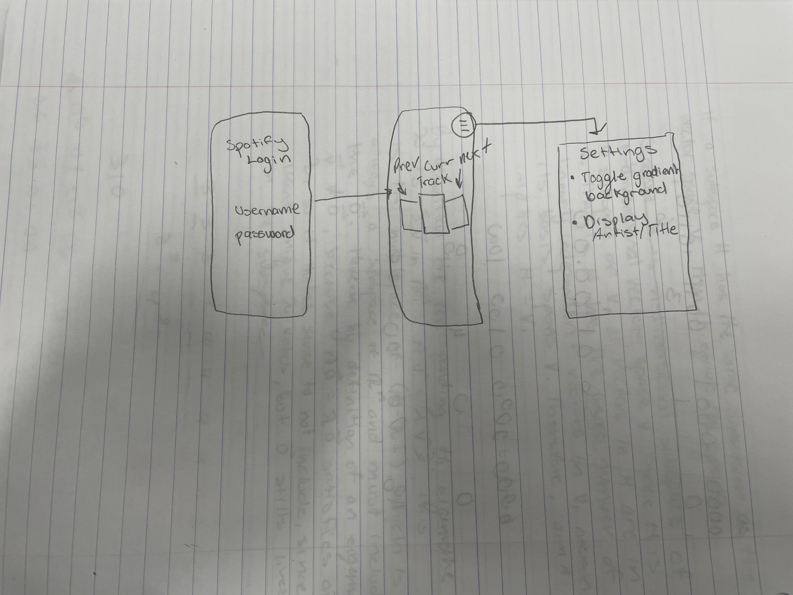

# 3D Cover Flow

## Table of Contents

1. [Overview](#overview)
2. [Product Spec](#product-spec)
3. [Wireframes](#wireframes)
4. [Schema](#schema)
5. [Demo](#demo)

## Overview

### Description

This app displays the currently playing song and upcoming tracks from your Spotify queue in a dynamic 3D Cover Flow interface. It visually syncs album artwork with a gradient background based on the current track's dominant colors and displays track metadata including album name, title, and artist in real time.

### App Evaluation

- **Category:** Music / Spotify Companion
- **Mobile:** iOS only
- **Story:** Allows Spotify listeners to experience a more aesthetic and immersive way of interacting with their queue, inspired by nostalgic iTunes Cover Flow.
- **Market:** Geared toward Spotify users who appreciate design-focused and dynamic music visualizations.
- **Habit:** Intended for frequent listening — opens with the current track, then visually updates as songs play or skip.
- **Scope:** Focused but extendable (e.g., adding 3D models, gesture control, or playlist browsing later).

## Product Spec

### 1. User Stories (Required and Optional)

**Required Must-have Stories**

- User can log in with their Spotify account
- App fetches and displays the currently playing track
- App updates when the track changes
- Album cover art is displayed in a centered carousel with previous and next tracks
- Background color gradient changes based on album art
- Track title, artist, and album name are shown for the current track

**Optional Nice-to-have Stories**

- Add 3D model overlay for each track
- Enable gestures (swipe to skip)
- Glow animation for the current track
- Playback controls (pause/play/skip)
- Show playback progress bar

### 2. Screen Archetypes

- **Main Player Screen**
  * Display current track in 3D carousel
  * Fetch and show upcoming queue
  * Update UI on song change

- **Login Screen**
  * Authenticate Spotify account via OAuth

### 3. Navigation

**Tab Navigation**  
*(No bottom tab bar in current version — single-screen app with dynamic content)*

**Flow Navigation**

- [ ] Login Screen
  * Navigates to Main Player Screen after Spotify auth
- [ ] Main Player Screen
  * Displays dynamically updating track carousel and metadata

## Wireframes

### [BONUS] Digital Wireframes & Mockups
*To be added later — current prototype built directly in Xcode.*

### [BONUS] Interactive Prototype
*The app is interactive in Xcode Simulator, swipe-enabled UI with carousel animation.*

## Schema 

*(To be completed in Unit 9 if backend needed — currently using Spotify Web API)*

### Models

| Property       | Type     | Description                        |
|----------------|----------|------------------------------------|
| id             | String   | Spotify track ID                   |
| title          | String   | Track name                         |
| artist         | String   | Artist name                        |
| album          | String   | Album title                        |
| albumArtURL    | URL      | Image URL for album artwork        |

### Networking

- **Currently Playing Track (GET)**  
  `https://api.spotify.com/v1/me/player/currently-playing`  
  Used to display the currently playing track.

- **User’s Queue (GET)**  
  `https://api.spotify.com/v1/me/player/queue`  
  Used to show the next song(s).

## DEMO

    
    
  

